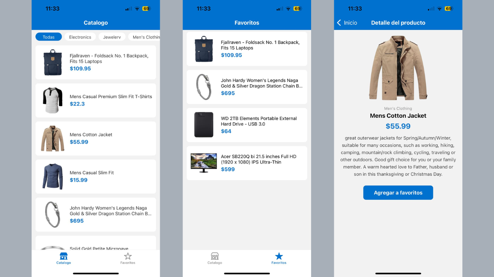

# 🛍️ Catálogo de Productos



## Tecnologías


---

## Cómo ejecutar el proyecto

### 1. Clona el repositorio

```bash
git clone https://github.com/[tu-usuario]/StoreApp.git
cd storeapp
```

### 2. Instala las dependencias

```bash
npm install
```

### 3. Inicia el servidor

```bash
npx expo start
```

### 4. Abre la app

| Dispositivo | Pasos |
|---|---|
| Celular físico | Instala **Expo Go**, escanea el QR (misma red WiFi) |
| Android | Presiona `a` en la terminal (requiere Android Studio) |
| iOS | Presiona `i` en la terminal (solo Mac, requiere Xcode) |

> ! Si estás en una red con restricciones, usa `npx expo start --tunnel`

---

## Sobre el Proyecto

Esta es una aplicación móvil de estilo catálogo (mini e-commerce) que muestra una lista de productos obtenidos desde una API pública (`FakeStore API`). Permite a los usuarios filtrar por categorías, ver los detalles específicos de cada artículo y guardar sus productos favoritos para consultarlos más tarde.

## Cómo Funciona

- **Consumo de API:** Se obtienen los datos de los productos y sus categorías de forma asíncrona mediante `fetch`.
- **Navegación:** Se utiliza `React Navigation` con una estructura combinada. Un `Tab Navigator` permite cambiar entre el catálogo principal y la lista de favoritos, mientras que un `Stack Navigator` permite abrir la pantalla de detalle de un producto específico.
- **Gestión de Estado y Persistencia:** El estado de los favoritos se maneja globalmente con `Zustand`. Se integra con `AsyncStorage` para asegurar que los productos guardados persistan en el dispositivo incluso si la aplicación se cierra.

## Puntos Extra

- [x] **Manejo de Estado Global (Zustand):** Gestión centralizada y ligera de la lista de favoritos, optimizando el rendimiento y evitando el prop drilling.

- [x] **Filtrado por Categorías:** Inclusión de un selector interactivo en la pantalla de inicio para filtrar el catálogo de productos de manera dinámica.

- [x] **Experiencia de Usuario (UX):** Control activo de los estados de carga mediante indicadores visuales (*loading spinners*) mientras se obtienen los datos de la API de forma asíncrona.

## Estructura de Carpetas

Toda la lógica de la aplicación se encuentra en el directorio `src/`, el cual está distribuido de la siguiente manera para mantener el orden y la escalabilidad:

```text
📦 src/
 ┣ 📂 api/          # Funciones asíncronas para comunicarse con la FakeStore API
 ┣ 📂 navigation/   # Configuración de los navegadores (Tabs y Stack)
 ┣ 📂 screens/      # Componentes de las pantallas (Inicio, Detalle y Favoritos)
 ┣ 📂 store/        # Configuración del estado global con Zustand
 ┗ 📂 types/        # Interfaces y definiciones de tipos para TypeScript